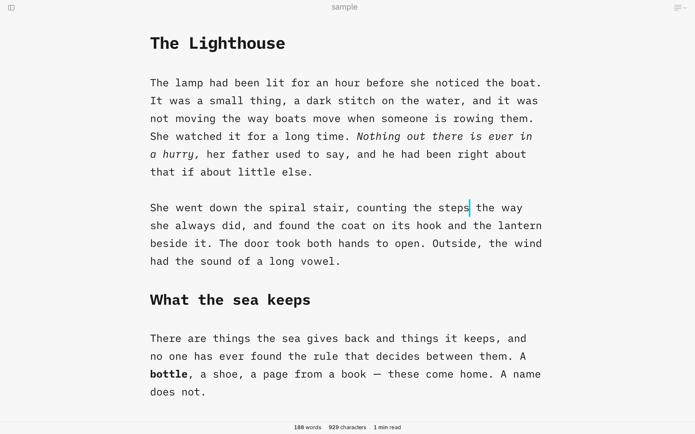
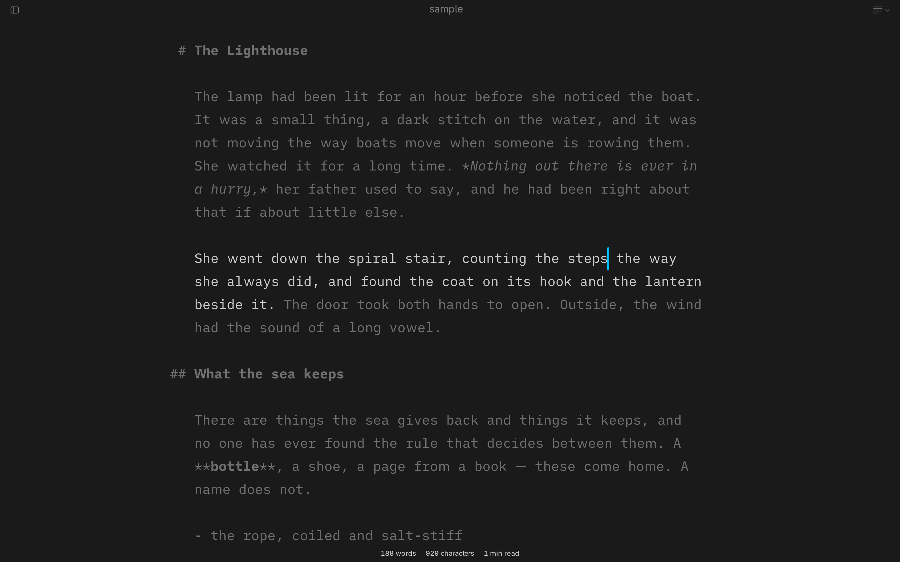

# Quill

A focused Markdown writing app for Linux. Native GTK4, written in Rust.



## Install

Quill is packaged for Arch Linux. From a clone of this repository:

```
makepkg -f
sudo pacman -U "$(makepkg --packagelist | grep -v '/quill-writer-debug-')"
git restore PKGBUILD
```

The package is `quill-writer` (Arch already has a `quill`); the command it installs is `quill`, and
it appears in the application menu. To update, pull and run the same three lines.

```
quill                   # a new document
quill notes.md          # open a file
```

## Features

- **Focus mode** dims everything but the sentence or paragraph you're writing; **Typewriter** keeps
  the current line in the middle of the window.
- **Live** renders Markdown in place: markup folds away except where you're editing, and headings,
  lists and checkboxes are drawn as they'll read. Files stay plain Markdown.
- **Library**: add folders and browse, search and sort their documents beside the page.
- **Preview** as a web page or a PDF, side by side or full window, and **Export** to PDF, HTML or
  Markdown in one of five templates, or print.
- **Writing tools**: spell check, style check (fillers, redundancies, clichés) and highlighting of
  nouns, verbs, adjectives, adverbs and conjunctions.
- **Statistics**: words, characters, sentences, paragraphs and reading time.
- Three typefaces (Duo, Quattro and Mono), light and dark, and palettes you can set yourself.



`Ctrl+K` opens every command and setting in one searchable list; `docs/shortcuts.md` lists every
shortcut.

## Theme Quill with the desktop

On Omarchy, Quill follows `omarchy theme set` with no relaunch after two steps:

```
cp /usr/share/quill/quill.toml.tpl ~/.config/omarchy/themed/
```

Then set the `palette` line in `~/.config/quill/settings.toml`, which Quill writes on its first
launch with `palette = ""` (change that line rather than adding a second):

```
palette = "~/.local/state/omarchy/current/theme/quill.toml"
```

Any tool that writes TOML can theme Quill the same way: a `[light]` and a `[dark]` table of colour
roles (`paper`, `ink`, `accent`, … — `docs/design.md` § The palette is a file names all twenty-one),
each `#rrggbb` or `#rrggbbaa`. Roles you leave out keep Quill's own colours.

## Spell check in other languages

Quill checks spelling through enchant, and the package brings English. For another language:

1. Install its dictionary: `sudo pacman -S hunspell-de` (`pacman -Ss hunspell-` lists them). Aspell
   and Nuspell dictionaries work too.
2. Or put a downloaded Hunspell pair in `~/.config/enchant/hunspell/`, named for its language tag
   (`de_AT.dic` and `de_AT.aff`).
3. Choose it in Settings › Writing tools › Spell check.

Words you add to the dictionary go to `~/.config/enchant/<tag>.dic`, shared with every enchant app.

## Building from source

```
cargo run -p quill -- notes.md    # needs gtk4 and enchant installed
cargo test
```

`docs/architecture.md` describes how the app is built, and `dev/README.md` covers the development
tooling.

## Licence

GPL-3.0-or-later (`LICENSE`). Quill's typefaces are derived from iA's open-source
[iA Writer fonts](https://github.com/iaolo/iA-Fonts) and, with Inter and Source Serif 4, are under
the SIL Open Font License 1.1 (`fonts/`). The bundled `harper-brill` tagger is Apache-2.0, and the
style check lists carry entries under MIT, BSD-3-Clause and CC0-1.0 (`data/style/SOURCES.md`).
